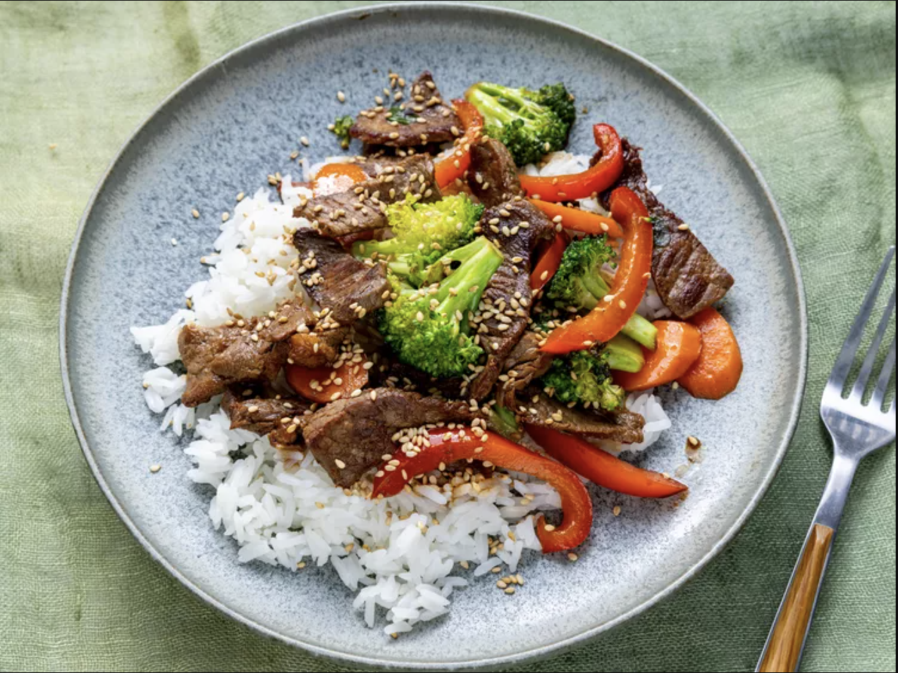

# Recipe for Beef Stir-Fry

### 1. Photo of the completed dish

 

### 2.Brief description of the recipe 

##### 1.How to make Beef Stir-Fry

The most time-consuming part of making stir-fry is all the chopping. Slicing your meat and veggies into smaller bite-sized pieces can take a little bit of time and effort, but it's worth it for the end result.

After you've chopped all your ingredients, you'll cook the beef on one side of the wok, or another large frying pan, and the veggies on the other side of the wok. Once they're all cooked, you can mix the two sides together and add the soy sauce and sesame seeds.

Some stir-fry recipes use a specific stir-fry sauce, which can be as basic as broth, soy sauce, sugar, and rice wine vinegar. This quick stir-fry calls for only soy sauce. But you can feel free to add a stir-fry sauce or marinate your beef in one if you prefer.

##### 2.What Cut of Beef is Best For Beef Stir-Fry

Flank steaks are the most popular choice for making a stir-fry. However, you can also use sirloin steak, skirt steak, Denver steak, or even beef chuck.

Beef chuck steak is the most economical choice, but it does require some extra trimming. You'll want to remove the tough tissue from the steaks before frying.

##### 3.How to Cook Beef Stir-Fry

If possible, you should use a [wok](https://www.allrecipes.com/article/best-woks/) to make beef stir-fry. Woks are large and have sloping sides that let you cook the entire stir-fry in one pan, so you can easily stir and flip the food without fear of it flying out. They also are designed to cook foods quicker than skillets and with less oil.

If you can't use a wokthen any skillet will work. You may just need to cook the meat and veggies in separate batches.

When cooking, make sure you heat the pan and oil up first before adding your ingredients — they should sizzle as soon as they hit the heat. And always use an oil with a high smoke point, like canola or peanut oil, for the best stir-fry results.

### 3.List of Ingredients

- 2 tablespoons vegetable oil
- 1 pound beef sirloin, cut into 2-inch strips
- 1 ½ cups fresh broccoli florets
- 1 red bell pepper, cut into matchsticks
- 2 carrots, thinly sliced
- 1 green onion, chopped
- 1 teaspoon minced garlic
- 2 tablespoons soy sauce
- 2 tablespoons sesame seeds, toasted

### 4.List of Instructions

- Gather all ingredients.
- Heat vegetable oil in a large wok or skillet over medium-high heat; cook and stir beef until browned, 3 to 4 minutes.
- Move beef to the side of the wok and add broccoli, bell pepper, carrots, green onion, and garlic to the center of the wok. Cook and stir vegetables for 2 minutes.
- Stir beef into vegetables and season with soy sauce and sesame seeds. Continue to cook and stir until vegetables are tender, about 2 more minutes.
- Serve hot and enjoy!

